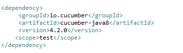

# REST API Testing Using Cucumber

This project is about testing REST APIs using cucumber. Cucumber is a framework highly used for testing REST APIs, compatible with [BDD](https://cucumber.io/docs/bdd/) (Behaviour Driven Development). BDD allows the developers and users to define the operations of an application in plain text. It works on the DSL ([Gherkin](https://cucumber.io/docs/gherkin/reference/) Domain Specific Language).

#### Downloads
1. Cucumber Eclipse Plugin  

   This Plugin is optional but it provides great support while creating gherkin file(.feature files). It can be downloaded directly from eclipse market place or offline through zip file. For downloading offline follow these [steps](https://github.com/cucumber/cucumber-eclipse/wiki/Download-and-Offline-Installation-Of-The-Plugin-From-Zip).
   
#### Maven Dependencies
In order to make use of Cucumber-JVM in a Maven project, the following dependency needs to be included in the POM:

To facilitate JUnit testing with Cucumber, we need to have one more dependency:

To execute Cucumber scripts in Spring Context.

#### Configuration

We'll now look at how we can integrate Cucumber in a Spring Micro service application. The first step is to create a Spring Boot application. Then we'll create a Spring REST service in the Boot application and write the Cucumber test for this REST Service.

#### 1.Rest Controller

As a first step let us create a controller class for simple CRUD operation on model Account :

**Account.java:**

**REST APIs for performing CRUD Operation:**

#### 2.Cucumber Configuration

1. The JUnit runner uses the JUnit framework to run the Cucumber Test. All we need is to create a single empty class with an annotation @RunWith(Cucumber.class):

   

   where field **features** points to the location of feature file and **glue** points to the location of step-definition.

2. Now let's have a look at our gherkin file(feature file)

   
   
   The gherkin file contain all the test cases in gherkin language which is similar to English. Each sentence begins with a keyword(Given, When, Then).
   
3. The next step is to create the method in the Java class to correspond to this test case:

   
   
### Testing APIs

Inorder to test you need to run the CucumberTest.java class as JUnit Case. Note your application should run at mentioned port before testing your application.

 

	

   
  
